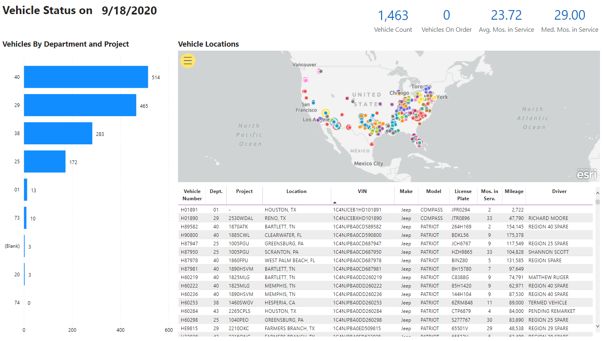
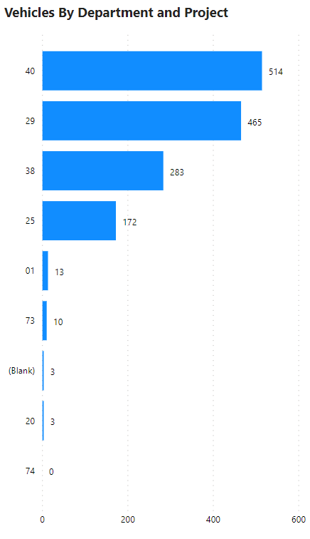
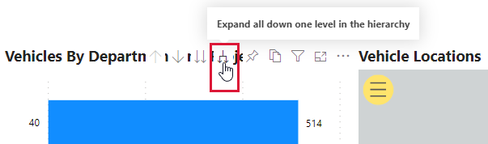
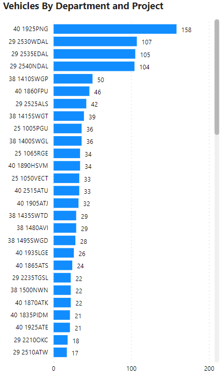

# Emkay

This report shows the current location, department and project information, and assigned driver for fleet vehicles.  It is based on a file that Emkay sends over every day and reflects the information that Emkay has for each fleet vehicle when the file is generated and sent over.

The main goal of this report is to give supervisors, asset managers, and anyone involved with the fleet a way to compare the information in Emkay to real life.  Similar to how the HELIX scan report is used to reconcile Asset Tiger to reality, this report should be used to reconcile Emkay to where vehicles really are.  Since Emkay is the system of record for the vehicle information, any discrepancies should be fixed in Emkay.  Once the information is changed in Emkay, it will take until the next day for the information on this report to catch up since Emkay only sends us one file a day.

## Report contents

As of this writing, the report has one visible page

* Vehicle status

## Information in the report:

Emkay sends over a file every morning with certain information about each vehicle.  That information is processed and certain fields are extracted and displayed in this report.

* Vehicle number
* Department
* Project
* Location
* VIN
* Make
* Model
* License plate
* Months in service
* Mileage


There is no Department field naturally in the Emkay file.  The conversion is done by taking the text field for Center Name and extracting information from that.  Any vehicle with a Center Name of CORP is considered to be in Department 01.  All other Center Names have been mapped to departments to the best of our ability.


Emkay also sends over a file every morning with driver information.  This file is taken as-is and the only fields used from it are the driver ID and first and last name.  The vehicle file has the driver ID for each vehicle, so that is matched to the driver ID from the driver file and the first and last name are converted to all caps \(for consistency\) so the driver can be displayed for each vehicle in the report.


There are no transformations done to the driver first and last names other than them becoming capitalized.  Any spelling or punctuation mistakes are carried over directly from the file Emkay sends.  No attempt has been made to match the drivers to actual employees.  This is mostly because there's no reliable unique field such as employee ID or email address that can be used \(several misspellings have been noted in the email addresses which means they will not match to actual employees\).  Also, there are several drivers in the file that don't map to an employee such as the region spares.


## Things to know

### Screenshots

Some of the screenshots may be hard to read.  Clicking on a screenshot will make it expand to full screen.  Clicking on it again will return it back to normal size.

### Available filters

Report level filters \(available on all pages\):

* Department
* Project
* Make
* Model
* State
* Vehicle Number
* Driver

## Report pages

### Vehicle Status

This page shows vehicle information at a glance.

The date next to "Vehicle Status on" updates whenever a new file is sent by Emkay.  It does NOT update based on what day it is.  For example, Emkay sent a file this morning, 9/18/2020.  If for some reason they don't send a file tomorrow morning, the date will still show as 9/18/2020 even though the actual date is 9/19/2020.  The date will then update whenever the next file is sent, regardless of if it's days, weeks, months, or even years.

On the left side of the page there's a horizontal bar chart that shows the number of vehicles in each department at the top level.  If you drill down, you can see how many are in each project.

The map shows the last reported location of the vehicle according to the Emkay file.  It is important to note that these are not GPS coordinates, they are taken from the City and State field from the Driver file.  The dots are colored by project.  You can zoom in and out by putting your cursor over the map and using the mouse wheel.  Or, you can click on the yellow circle with the three black lines and use the options there to find or select parts of the map.

Below the map is the vehicle information in table view.  There shouldn't be any duplicate vehicle numbers as the information shown is only the most recent information that's in the Emkay file.


During the development and review period, it was noted that some of the values for the amount of months certain vehicles have been in service don't seem to be accurate.  To the best of our knowledge, those are vehicles that were moved from Element into Emkay.  Again, the information is what is given to us by Emkay in the files they send over so if there's any questions about if the information is right or not, your asset manager is the best person to ask.


Above the map are four tiles that have basic calculations.

#### Vehicle Count -

The number of vehicles in the fleet according to Emkay.

#### Vehicles On Order -

The number of vehicles currently on order \(but not yet placed in service\).

#### Average Months in Service -

The average number of months the active vehicles have been in service.

#### Median Months in Service -

The median number of months the active vehicles have been in service.


The reason both the median and average months of service is shown is because the values for the months of service aren't normally distributed \(fits on a bell curve\).  When values aren't normally distributed, the average \(mean\) is misleading as an indicator of the "middle" because the values will tend to clump around certain numbers of months based on when the vehicles were ordered.  In these cases, the median is a better measure of central tendency than the average.

 For those who aren't familiar with the calculation, the values are placed in lowest to highest order, repeat values are included.  If the number of values is odd, the value in the exact middle is the median.  If there are an even number of values, the median is the average of the two middle values.


## FAQs

### Are termed vehicles included in the vehicle count?

No.  Even though those vehicles are visible in the table, they aren't included in the vehicle count.

### Are POVs included in the vehicle count?

No.  All POVs are marked as Kias in the Emkay file and are filtered out as part of the data preparation steps.

### Are other vehicles included in the vehicle count?

Yes.  Trailers, 4-wheelers, and other special types of vehicles are included in the vehicle count.

### Changelog

### 9/21/2020

* Initial release

