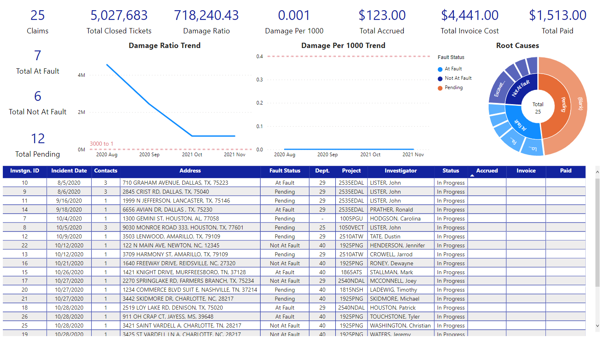
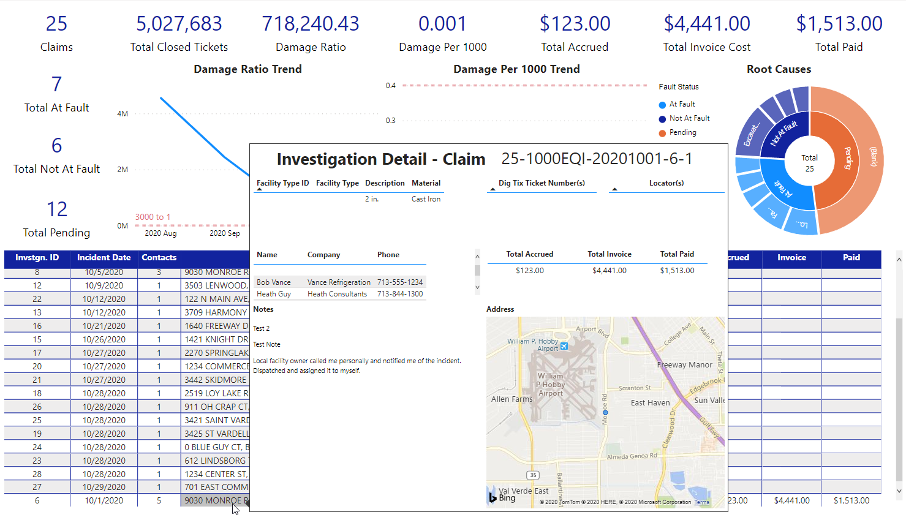

# ICM

This report shows information about monetary claims brought by other parties against Heath. At the moment it only includes utility locate damages.  
  
The main goal of this report is give supervisors and managers a way to see information related to the progress and result of investigations in the ICM app.

## Report contents

As of this writing, the report has one visible page

* ICM

## Information in the report:

Information concerning claims is entered into the ICM app by people investigating potential damages allegedly caused by Heath personnel.  There are too many fields to list here but some of the information is combined with other data from sources maintained by Heath IT so it can be used for calculation and display purposes.  

## Things to know

### Available filters

Report level filters \(available on all pages\):

* Department
* Project
* Date
* Supervisor
* Employee
* Project
* Fiscal Year
* Fiscal Year Month
* Status
* Fault
* Root Cause

## Report pages

### ICM

This page shows a summary of the claim information as of the last data refresh.

There are four "cards" running down the left side of the report above the grid.  From top to bottom there are the total claims, how many are at fault, how many are not at fault, and how many have a fault status that hasn't been determined yet.

#### Claims - 

Total number of claims being tracked in ICM.

#### Total At Fault -

Total number of claims that've been determined to be the fault of one or more Heath employees.

#### Total Not At Fault -

Total number of claims where it's been decided that no Heath employees are at fault.

#### Total Pending -

Total number of claims where the fault status hasn't been finalized.

Next to the total claims card and running from right to left across the top are six more cards.  Starting on the left they show the total number of closed locating tickets, the damage ratio, the damage per thousand rate, the total amount of money accrued towards damages, the total amount that's been invoiced, and the total amount that Heath has paid against the invoices.

#### Total Closed Tickets -

The total number of closed locate tickets up through the previous day.

#### Damage Ratio -

The total number of closed tickets divided by the total number of at fault claims.

#### Damage Per 1000 -

The total number of at fault claims divided by the total number of closed tickets multiplied by one thousand.

#### Total Accrued -

The total dollar amount set aside to pay for a claim.

#### Total Invoice Cost -

The total dollar amount from all invoices sent to Heath after a claim is determined to be Heath's fault.

#### Total Paid -

The total dollar amount paid towards the invoices.

Below the cards and above the grid are two line charts and one donut chart.  The first line chart shows the trend for the damage ratio, the second line chart shows the trend for the damage per thousand rate, and the donut chart shows the breakdown of the root causes by type.

The grid shows basic information about each claim.  Hovering over any of the claims on the grid brings up a tooltip that has more detailed information about that claim.

The claim number at the top is a composite key that uniquely identifies each claim investigation.  You will also be able to see info about the damaged facility, any ticket numbers that are associated with the claim, contact information for other parties, financial information, notes, and a map.

## FAQs

### What is the difference between a claim and an investigation?

In the context of this report a claim represents a potential damage that has been reported to Heath.  After Heath gets the report, an investigation is conducted.  Each claim will have one investigation associated with it.

## Changelog

### 11/6/2020

* Initial release

