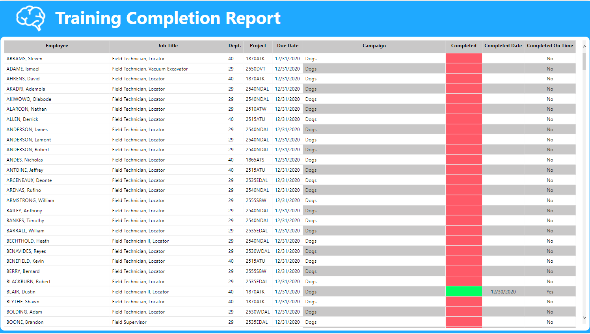

# Training

This report shows completion information for training modules required by Atmos Energy for all locating projects we have with them.  Region 40 also utilizes these training modules across all of their locating projects.

Completion is only shown for the job titles and project combinations that are required to do the training.  Currently these are Field Supervisor; Field Technician, Locator; Field Technician II, Locator; Field Technician, Vacuum Excavator; and Field Technician, Standby Locator in all Atmos locating projects regardless of region and any locating projects in Region 40.

While the training is open to others such as Areas Managers and safety and compliance staff, if they complete any of the training, that will NOT be reflected in this report.

## Report Contents

As of this writing, the report has one visible page

* Completion

## Information in the report:

Atmos conducts their own audits of our work on a monthly basis.  Based on the results, they identify areas for improvement and pass that along to Heath.  A training module is developed and assigned to the combination of job titles and projects listed above.  The training topics are organized in an app that can be accessed through Teams, Dynamics 365 \(in a web browser\), or Power Apps \(mobile device\).

After an employee completes the training, they sign an acknowledgement in the app.  This acknowledgement is recording in one of the underlying data sources.  Various data points from the acknowledgements are compared to a list of the people who are expected to have completed the training.  The list is regenerated every day based on the combination of job title and projects listed above.

If an employee is on the list of people expected to complete the training, all the training that they've been expected to complete \(and is still a live training module\) are shown on the list.  If they drop off the list for whatever reason, none of their completion information will show.  However, the record of their completion is still kept in the data source. It just no longer shows in this report.

## Things to know

### Available filters

Report level filters \(available on all pages\)

* Campaign \(training title\)
* Due Date
* Department
* Project
* Employee
* Supervisor

## Report pages

### Completion

This page shows a summary of the completion information as of the last data refresh.

The only visual is a single table that lists each employee required to complete training and some details such as job title, department, project.  Continuing to the right, there are the Due Date, Campaign, Completed, Completed Date, and Completed on Time columns.

These columns are self-explanatory for the most part.  Campaign is the name of the training modules the employee is expected to have completed, Completed shows if the training was completed or not \(green = yes, red = no\), Completed Date is the date the employee acknowledged they completed the training, and Completed on Time shows if they did the training before the deadline.


If an employee was hired after the training was due and completed it anyway, they will still show as having completed it after the due date.  While they are technically late it shouldn't be held against them because obviously they couldn't complete a training on time if the due date was before they started working for us.


## FAQs

### Can I see completion for people who don't work here any longer?

Not at the moment.  If this is requested in a future version of the report it will be revisited.

### How do I see completion percentage by region/project/employee?

This isn't calculated at the moment.  If this is requested in a future version of the report it will be revisited.

## Changelog

### 12/31/2020

* Initial release

