# DigTix

## Introduction

This report gathers information from DigTix and shows it in one place to make it easier to see historical ticket information.

The report is **not** intended to replace DigTix for the day-to-day management of tickets.  Those tasks should always be done in DigTix.  Due to the way we are getting the data from DigTix, the information in this report will never be real-time.

## Report contents

As of this writing, the report has four visible pages:

* Ticket Summary
* Force To Load
* Performance
* Force To Load Alternate

There are two hidden pages that can be reached by drillthrough:

* Closecode Drillthrough
* Ticket Detail

The charts on these pages will be explained in more detail below.

## Information in the report:

As noted in the introduction, the information in this report is **not** real-time.  Early every morning DigTix sends us a file that has the information for every ticket that's active as of the time that they generated the file.  On our end we pick up the file, automatically process it, and put the results into a place that the report refreshes from.  The report refresh only happens once a day, at 6:30 a.m. Central time.

The tickets go all the way back to 7/26/2018 which is the first day that we were live with DigTix.


Due to the way the information is received and processed, it may take a few days for ticket totals and other calculations to fully update.

Every day there are tickets added to the DigTix system after midnight but before the file is created by DigTix and sent to us.  All the tickets added after the file is created until midnight that day will be on the next day's file and we've seen it take a few days for the ticket counts to catch up.

**Example:**

On 8/19/2020, 1688 tickets were added to DigTix between midnight and 4 a.m. that morning \(pretend that's when the file is created\).  The file that DigTix sends us on the morning of 8/19 will have those 1688 tickets.

From 4 a.m. until midnight on 8/19, pretend that another 10,000 tickets are added .  The file the next morning will have the information for these tickets and those 10,000 tickets will be added to the 1688 existing tickets for 8/19 bringing the total up to 11,688.  However, you won't see that ticket total until later in the week on the **Force To Load** page.

This isn't limited to just one day before the current day either.  The ticket total for 8/18 is lower than normal for a Tuesday but it will catch up over the next few days.  This was closely monitored during the two weeks the report was running in our development environment to make sure the ticket counts eventually caught up.



Because of the number of tickets that are in the data source, we are using an incremental refresh strategy.  Normally in the Power BI service when a report is refreshed, the existing data that's saved is erased, the report script runs, goes to the data source\(s\) that are used for the report, brings everything back in and crunches it, then shows the results.

With almost 4.5 million tickets in the system as of this writing and an average of almost 9,000 tickets added daily, it will take longer and longer for the report to refresh if we do it the standard way.

Incremental refresh allows us to bring in and save a certain chunk of the data when the report is first published and then only bring in new data for a set period of time when the data refreshes.

At the moment, the incremental refresh is set to bring in five years worth of data initially and then only bring in 10 days worth of information when the report refreshes every morning.

Since the information is going back 10 days, it's very possible that the numbers can change constantly because ticket information is being updated.  This is another reason why this report shouldn't be used for day-to-day operations.

The setting in the incremental refresh for how many days to bring in can be changed.  So far 10 days seems to be working but it can be adjusted if needed.


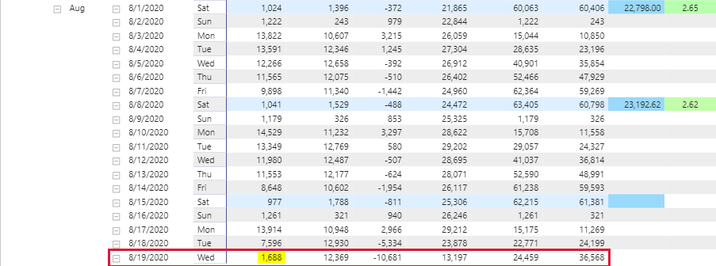

## Things to know

### Screenshots

Some of the screenshots may be hard to read.  Clicking on it will make it larger and clicking on it again will put you back into this document.

### It might take a while to load the first time you go to each page

There is a ton of data in this report and it may take a little longer than you're used to for it load the first time you open it.  The **Performance** page will probably take the longest to open.

Be patient, it'll open eventually and after the first time, the pages should load pretty close to normally.

### If there's a problem...

A problem with the report is something along the lines of not having access or being able to see it when you should, visuals are broken or show an error message, etc.  If you come across something like that, please [put a ticket in to the helpdesk](mailto:helpdesk@heathus.com) and I will get to it as soon as humanly possible.

### If you have suggestions, comments, or questions...

Please visit the [Power BI Tips, Tricks, & Answers Yammer group](https://www.yammer.com/heathus.com/#/threads/inGroup?type=in_group&feedId=20061200384&view=all) and post a message.

All suggestions and requests for features will be considered.  If they are included or not, and when they will be added is up to the department that owns the report \(SBU in this case\) and the Director of Information Technology.

I will answer questions as soon as I can get to them which is usually within a day.  It's been noted that I go a little overboard in answering questions, but it's because I want to be as thorough and transparent as possible.  If I don't fully answer your question, feel free to keep the convo going until I do.

### Available filters

Report level filters \(available on all pages\):

* Date
* Department
* Project
* Employee
* Supervisor

Page level filters \(available on specific pages\):

* CDC \(**Performance\)**
* Assigned User \(**Performance\)**
* Assigned Team \(**Performance\)**
* Excavator \(**Performance\)**
* Facility Owner \(**Performance\)**
* One Call Center \(**Performance\)**

### Pre-filtering

It's highly recommended that before you click through to different pages of the report, set some filters to narrow down the amount of tickets that the report will have to display.  There's a visual on the **Performance** page that **will** crash and error out if filters aren't applied.  As of this writing \(8/20/2020\) there are almost 4.5 million tickets in the dataset.

The first ones I would set are the Supervisor and Project filters if you're a Field Supervisor.  If you're an Area Manager, pick the supervisors that report to you.

In this report the date filter is very important too.  We haven't tested to find what the largest date range we can pick without crashing that visual but if you stay within the last 90 or so days you should be OK even if you don't set any other filters.

Under normal circumstances it makes the most sense to put the date filter in Relative date mode, then pick a number of days, weeks, months, or years to look back.

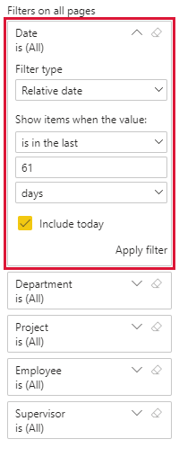

You can also look at a span of dates by putting the filter in Advanced filtering mode.

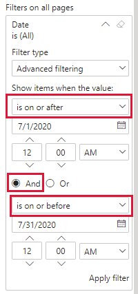

Pay close attention to the options for when the dates start and end.  You can see everything from a certain date to present by only using the top option and picking the start date.

The time options also work so you can narrow down tickets on a day based on when they were added to the system.

As always, remember to click **Apply filter** when you are done making your choices in each filter.

### Variance with DigTix reports

The calculations will be explained in more detail in the sections for each page but one thing to keep in mind is that the numbers this report shows and the numbers that DigTix shows will almost never match exactly.

It makes sense when you think about it because when you run a report from DigTix, the results are showing real-time information whereas this report is relying on "stale" data that isn't up to date.

This was one of the major obstacles with building this report because normally things should match exactly.  When we were validating the calculations against DigTix, we were off by less than one percent in virtually every sample we compared and in some cases were within a fraction of a percent \(0.03% for Responded On Time Percentage in one sample\).  SBU Management has agreed that this is close enough for the intended purpose of this report.

## Report pages

### Ticket Summary

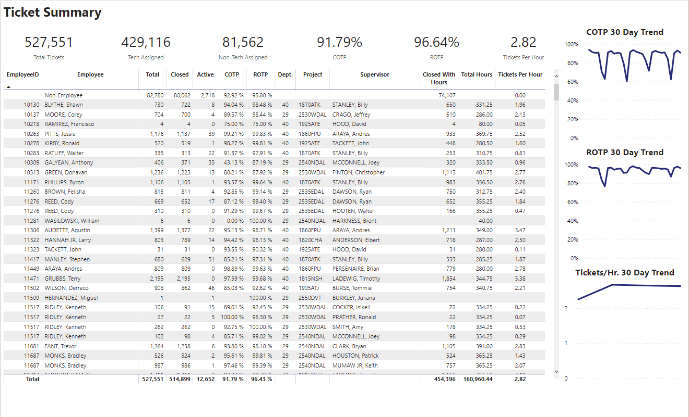

This page shows top level information based on whatever filter selections are made.

The main table in the middle shows information by employee.  Location and supervisor information is based on who the employee's supervisor was and what project they belonged to on the date that the ticket was most recently updated.


The most recent update value is from a calculated column inside the data model that returns the most recent timestamp for a ticket from the added, responded, and completed columns.


Across the top are the tiles for Total Tickets, Tech Assigned \(tickets assigned to a Heath locator\), Non-Tech Assigned \(tickets assigned to facility owner representatives, put in buckets, etc.\), COTP \(Completed On Time Percentage\), ROTP \(Responded on Time Percentage\), and Tickets Per Hour.

Down the right are 30-day trend charts for COTP, ROTP, and Tickets Per Hour.

#### Total Tickets -

This is the total number of unique tickets.  Because each ticket can have slightly different information based on if it's been reassigned or if there's multiple CDCs or close codes, we had to come up with a way to tell those apart.  We ended up combining a shortened version of the One Call Center name, the ticket number, the revision, and the CDC.  


Another reason we had to do this is because Florida and South Carolina have one call centers that use the same ticket numbering scheme.  We found several examples where a ticket in one state had the same number as a ticket in the other state.  If we only counted the unique ticket, one of the tickets with the same ticket number wouldn't show up in the calculation.


#### Tech Assigned -

The number of unique tickets that are assigned to Heath employees.


The assigned user column from the DigTix file is used to match DigTix usernames to Heath email addresses.

Remember when the old usernames were changed to email addresses?  This is why.  It was impossible under the old user naming scheme to be able to positively identify which employee matched to the assigned user.

This matching depends on the list of users that is in DigTix.  It's very possible that there are some DigTix usernames that haven't been updated to a Heath email address even though the user is a Heath employee.

Since those usernames don't match to a Heath email, it will show as "Non-Employee" like all the other usernames that aren't Heath emails.  Those tickets will **not** show up in the Tech Assigned count and will show up in the Non-Tech Assigned count instead.


#### Non-Tech Assigned -

The number of unique tickets that are assigned to a user who is not a Heath employee.

Basically, if the assigned user in DigTix doesn't match to a Heath employee through their email address, they are in this count.

#### COTP -

The percentage of completed tickets that were completed before the completion due timestamp.

#### ROTP -

The percentage of tickets that were responded to before the response due timestamp.

#### Tickets Per Hour -

Number of completed tickets divided by number of hours.  The hours come from the same table as the hours in all of our other reports.


There are two main things to know about this calculation.

One, the hours are updated every Monday and when they're updated, they're only updated through the second most recent pay period.  The easiest way to think of it is the hours that are on your most recent paycheck.  This means the hours can lag behind the number of completed tickets for up to 15 days.  There are technical reasons for this which won't be explained here but for now there's no way around this limitation.

Two, because of this, there's a second closed ticket calculation in the main table on this page.  It's called Closed With Hours and it's the number of tickets that were closed up through the most recent day that we have hours for.  This number will usually be less than what's in the Closed column in the same table.

**Example:**

In August 2020, the ends of the pay weeks fall on 8/1, 8/8, 8/15, 8/22 and 8/29.

This is being written on 8/20 and the **Force To Load** page shows closed tickets all the way through 8/19.  Pretend that we want to see the tickets per hour from 7/26 to 8/19.

However, we only have hours for the weeks ending 8/1 and 8/8 at the moment.

If we divide the number of closed tickets through 8/19 by the number of hours through 8/8 the calculation will be way off.  A rough calculation comes up with 4.77 tickets per hour \(219,153 closed tickets from 7/26 to 8/19 divided by 45,990.62 hours from 7/26 to 8/8\).

Instead, we should be dividing the number of closed tickets through 8/8 \(121,204\) by the same number of hours \(45,990.62\) since those hours match the closed tickets through 8/8.

Tickets per hour is now 2.64 which is correct.

The calculation shows as being on a Saturday because that's the day that the hours end for our work week.

Until we are able to automatically and reliably get the hours on a daily basis, this is the best we can do.


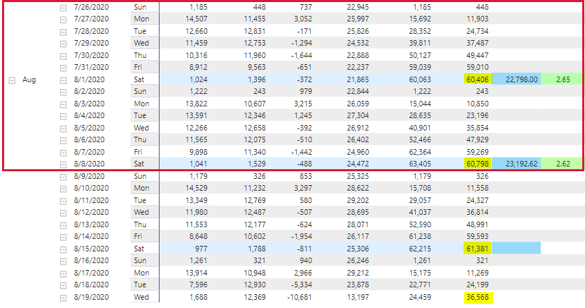

The chart above has the information I used in the example.  To get the total number of closed tickets from 7/26 to 8/19, I added the four numbers highlighted in yellow.  The total hours are in the blue boxes.  As you can see, there's no hours for 8/15.

To make the calculation apples to apples, only the numbers in the yellow and blue highlights in the outer red box are used for the Tickets Per Hour calculation.

#### Main table columns

I'll skip the obvious ones such as Employee ID, Employee, etc.

* Total tickets - Same as the Total Tickets calculation.
* Closed - Unique tickets that have a timestamp in the Last Completion column in the DigTix file.
* Active - Unique tickets that don't have a timestamp in the Last Completion column.
* COTP - Same as the COTP calculation.
* ROTP - Same as the ROTP calculation.
* Closed With Hours - Tickets that were closed during the weeks that we have hours for.
* Total Hours - All hours that the employee was paid for \(including PTO/PTI/Holiday\).
* Tickets Per Hour - Closed With Hours divided by Total Hours.

#### Trend graphs

For COTP and ROTP, the daily values over the past 30 days are shown.

Tickets/Hr. is **not** daily for the reasons explained above.

### Force To Load

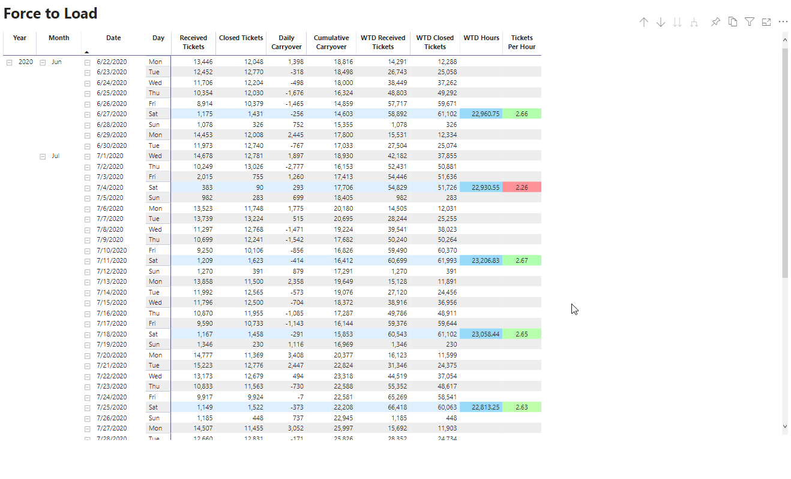

This page is meant to show the ticket load over time.  It helps give a snapshot of how many tickets come in and are closed each day.  More importantly it shows how many tickets ahead or behind the team or project is.

The effects of the incremental refresh will be the most noticeable on this page because everything is broken out by day.  As I explained in the section about how the ticket info is brought in, it's very possible that the calculations will show different values from one day to the next.  

#### Main table columns

* Received Tickets - The count of tickets that were added to the DigTix system for the given day.
* Closed Tickets - The count of tickets that were closed for the given day.
* Daily Carryover - Received Tickets minus Closed Tickets for the given day.
* Cumulative Carryover - Running count of Daily Carryover.  This is a gauge of how ahead or behind we are overall.
* WTD Received Tickets - Running count of Received Tickets for each work week \(Sunday through Saturday\).
* WTD Closed Tickets - Running count of Closed Tickets for each work week.
* WTD Hours - Total of all paid hours \(including PTO/PTI/Holiday\) for each work week that we have them for.
* Tickets Per Hour - WTD Closed Tickets divided by WTD Hours for each work week that we have hours for.

#### Color coding on Tickets Per Hour

We've set up conditional formatting on the Tickets Per Hour column to more easily see the high and low values.

The most important thing to understand at the moment is that the report is only going to look at the values that are included after filter selections are applied.  In practical terms that means that it's only looking at the values you can see on the report and then applying the logic to that column to assign colors.

Currently it's set so that the higher tickets per hour values shade green and the lower values shade red.

**This can be changed so that the values turn colors based on set rules if that makes things easier to see.**

Something like the example below can be done so that if the values fall within a certain range they'll turn the same color regardless of how the report is filtered.

```text
If Tickets Per Hour is less than 2, turn the value red;
If Tickets Per Hour is greater than or equal to 2 and less than 2.5, turn the value yellow;
If Tickets Per Hour is greater than 2.5, turn the value green
```

### Performance

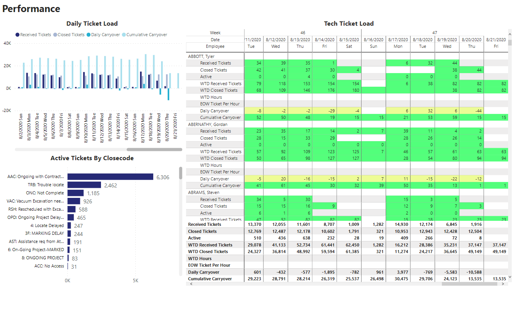

This page gives more detail than the Force To Load page because it shows those same calculations at the tech level as well as some more insight on tickets that are still active.

To be perfectly honest, this page could probably replace the Force To Load page since it's the same information in more detail.

#### Daily Ticket Load

This is just Received Tickets, Closed Tickets, Daily Carryover, and Cumulative Carryover shown as a bar graph and by the day.  It helps show patterns over time and makes it easier to see.

#### Tech Ticket Load

This is pretty much the same stuff as what's on the Force To Load page except turned sideways so that the calculations show as rows underneath each tech and the dates run across the top.  The week numbers are above the dates.

The only thing that might look weird is the EOW Tickets Per Hour row.  In reality, it's just the Tickets Per Hour calculation from the Force To Load page except I forgot to change the display name in this visual.

#### Color coding in the Tech Ticket Load visual

The color coding here follows the same general rules as it does in the Force To Load page.  The colors are actually mostly placeholders so I could see how it would look.

I am definitely open to feedback on what colors to put in the different ranges based on the calculation.  For example, what's considered a good day for the number of tickets closed, how many is a lot of new tickets, how many tickets is normal for a tech to have active, etc.

The general idea is to be able to see techs that may be overloaded or struggling by using color patterns to draw attention.  Sort of if a tech's colors are mostly green, they're doing fine, if there's a lot of red, they may need attention.

Please let me know what feedback everyone has for this.

#### Active Tickets By Closecode

This shows the number of active tickets broken down by close code.


During report testing, Bill Strickland asked a really good question that had to do with the AST close code.

While looking into it, Bill explained that those tickets are closed with a different close code, so the row where the ticket has the AST code will never show as closed while the row with the different close code will.  This means that the AST tickets that show as active in this chart might or might not actually still be active.  As a consequence, the count might higher than it actually is.  Everything depends on your filter settings so in some cases the count could be right while in others it's not.

This will be addressed in the future.  There may be other close codes that have a similar situation so that will have to be researched.  Then we'll have to figure out how to tell the difference between the tickets with those close codes that have been closed and the ones that are still open.


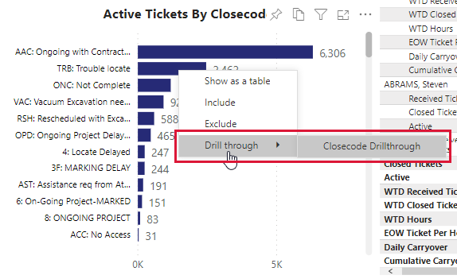

To get detail on the tickets under each close code, right-click on the matching bar and choose Drill through and then Closecode Drillthrough.

The next page will have info about all the tickets that are still active under that close code.

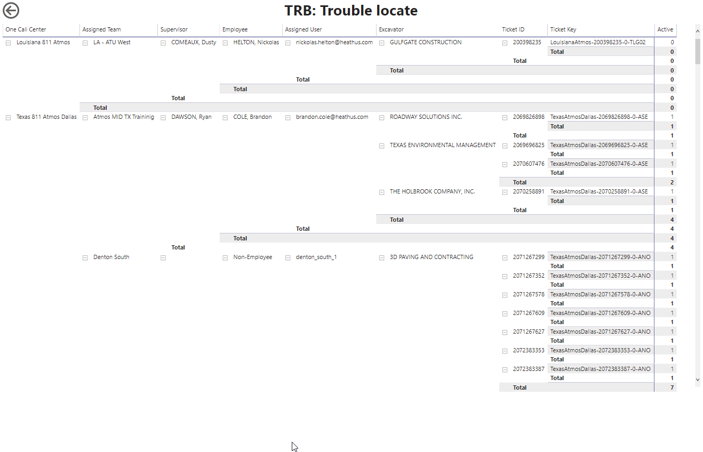

From here you can either go back to the Performance page by clicking the arrow in the circle in the upper left corner or you can pick a ticket and see some more information about that ticket.

To see more detail, pick a ticket and right-click.  Go to the Drill through option and click Ticket Detail.

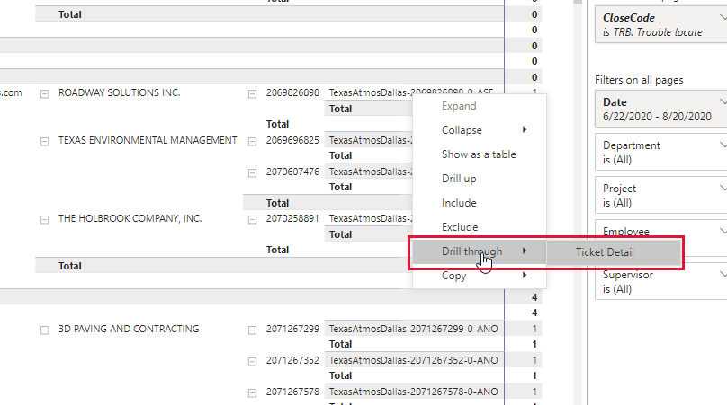

You'll end up on a page with more details about the ticket you picked.


To get out of this page, click the arrow in the circle.  This takes you back to the Closecode Drillthrough page.  From there you can pick another ticket to look at or you can go back to the Performance page by clicking the arrow in the circle.

### Force To Load Alternate

I'm going to be 100% honest with everyone.  This page is completely useless.  The only reason it's on here is because I forgot to delete it.  Which I will do when it's time to make the improvements to this report.

Kindly disregard that report page.  It's embarrassing.

## FAQs

### Ticket totals don't add up?

On the ticket summary page, there will be times where the Tech Assigned and Non-Tech Assigned numbers don't add up to the Ticket Total.

This happens when filters are applied.  Because of the different combinations of date, project, employee, etc., tickets may have more than one "state" that they're in depending on those filters.  For example if the date is filtered, a ticket might have been both assigned to a non-tech and a tech during the time covered by the settings in the date filter.  This can happen when a ticket is moved from a bucket to a tech and vice versa.

If all filters are cleared, the Tech Assigned and Non-Tech Assigned totals **will** add up to the Ticket Total.

The Total, Closed, and Active counts will always add correctly regardless of if there's a filter applied or not.

### Tech's hours are the same for more than one supervisor?

Depending on the filter settings, a tech may have more than one row in the main table on the Ticket Summary page.  Whenever that happens, it's because the tech had more than one supervisor in the information that's bounded by the filter settings.

At the moment, we don't have the hours by supervisor included.  We'll be doing some overhauling of the entire architecture behind all the reports and this will be addressed then.

Until then, the hour total is correct for that tech and the overall tickets per hour calculation will be right but the tickets per hour on each row isn't accurate.

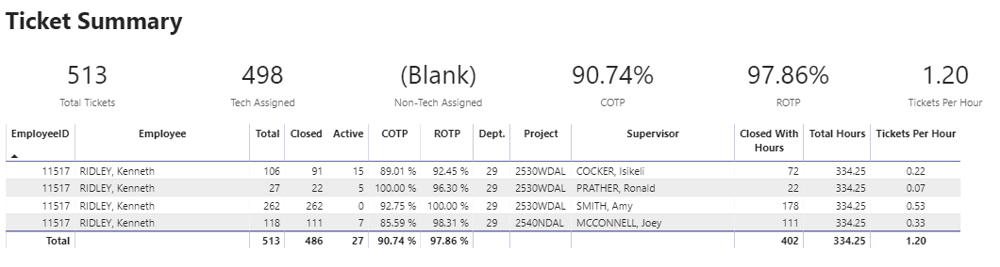

This tech had four supervisors during the time period the report is filtered to \(last 2 months in this case\) and had 334.25 hours over those two months.  The 334.25 value shows for each supervisor even though the tech didn't work that number of hours for each supervisor.  However, the tickets are broken out by supervisor.  The tickets per hour for each row are obviously wrong because it's dividing each value in Closed With Hours by all the hours.

However, the math is right when you divide the values on the total lines.  Closed With Hours \(402\) divided by Total Hours \(334.25\) equals 1.20 which is the Tickets Per Hour value.

## Changelog

### 8/24/2020

* Initial release

