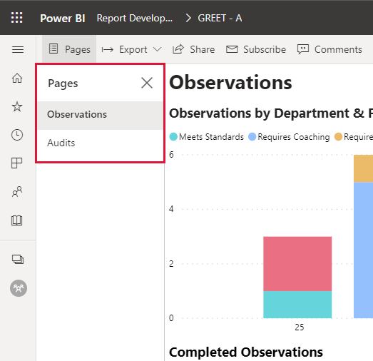
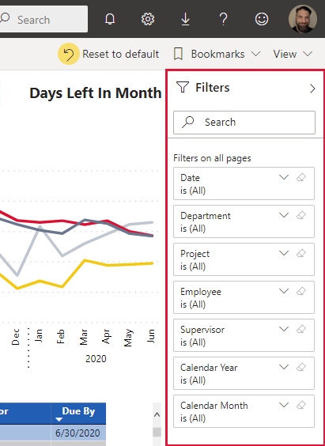
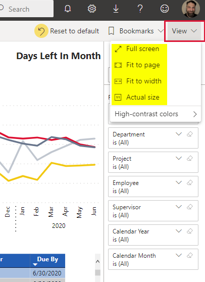
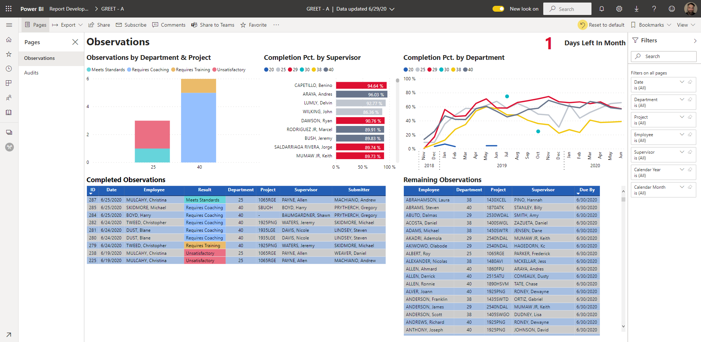
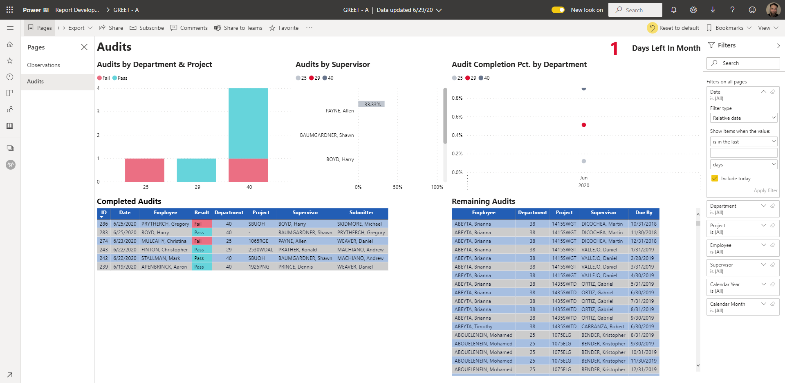
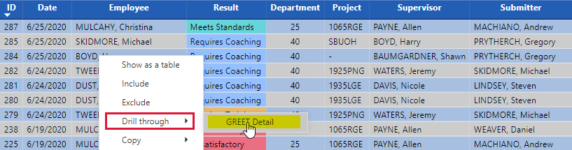
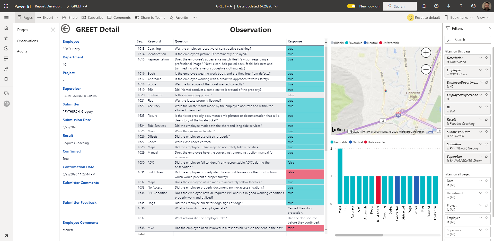

# GREET

## Introduction

The GREET Power BI report works as the companion to the GREET app which is the replacement for Observation360 \(O360\). The report should be somewhat familiar as it is very similar to the one for Observation360.

Some of the information has been carried over from the O360 app into this report.  While the details of each observation in O360 aren't brought forward, the completion information has.  This means that completion percentage is available back to November of 2018 even if the observation details aren't available in the GREET report.

However, the O360 report will stay in the SBU Management and Field Supervisor Power BI apps for historical reference, so all the detailed information about each observation will still be available.

## Features

### New pages

* Audit page for showing audit completion information
* Drilling through to the detail for an observation or audit will bring up a unified page called **GREET Detail** \(replaces the **Observation Detail** page on the O360 report\)
  * Submitter feedback & comments as well as employee comments have been added to the details on the left side
  * The question and response visual has been expanded vertically to reduce the of scrolling needed to see each event
  * The map has been reduced in size but still allows for zoom in/out
  * A new visual shows the number of questions answered by their keyword \(PPE Condition, Slip Trip Fall, Vehicle, etc.\) as well as color coding that matches the question/response visual

### New visuals and formatting

* **Completion Pct. by Supervisor** - shows each supervisor's overall completion percentages for both observations and audits, the observation completion percentage goes all the way back to the start of the Observation360 app
* Both the **Completed Observations** and **Completed Audits** visuals have the background color of the **Result** column coded to match the results show in the Observations by Department & Project visual
* **Remaining Observations** and **Remaining Audits** show the employees that haven't been observed or audited based on the date range selected in the date filter
* A color coded **Days Left** visual shows the number of calendar days left in the current month
* On the **GREET** Detail page, several improvements have been made to give some additional detail about the observation or audit that was selected on the main pages

### Report level filters

* Date
* Department \(Region\)
* Project
* Employee
* Supervisor
* Calendar Year
* Calendar Month


If a date range is selected that is less than a month long, the **Observations** or **Audits by Department & Project** and **Completed Observations** visuals will blank out.

**Example:**  The Date filter is set to Advanced Filtering mode and the date range of 6/1/2020 to 6/15/2020 is put into the filter.  The two visuals will blank out even though observations or audits were done in that time frame.

**Note:**  Until there is data covering more than one month in the app, it's unknown how the visuals will react when the date span covers a combination of full and partial months.



The best way to avoid this issue is to use the Date filter in Relative date mode \(explained more in [this Yammer post](https://www.yammer.com/heathus.com/threads/615811318915072)\).  Picking the "is in this" option in the top box and "month" in the bottom box and then Apply filter will keep the information on the report pages narrowed down to the current month.


## Observations vs. audits

While the term audit is sometimes used interchangeably with observation, for the purposes of the GREET app and this report, they mean different and specific things.  When referring to either in this document and for use in calculations, observations and audits are defined as follows:

**Observation:**  The observer is present with the employee watching them perform work and filling out the app based on what they see.

**Audit:**  The employee is **NOT** present and the auditor is looking at work done in the past by an employee and filling out the app based on what they see.

## Report navigation

As with all Power BI reports published by Heath, the report pages are listed on the left side near the main navigation bar.  Clicking on a page name will bring you to that page.

Filters are on the right.

If you want to change how much of your screen the report takes such as if you are presenting and using a projector, choose the view option right above the Filters.

## Report pages

### Observations

When you first open the report, you will see the Observations page.

As with every Power BI report, the pages are listed on the left and the filters are on the right.

The picture has sample data from testing in it so not all of the regions are represented in the **Observations by Department** & **Project and Completed Observations** visuals.

The **Observations by Department** & and **Completed Observations** visuals work exactly like they did on the existing O360 report that's in the SBU Management and Field Supervisor report Power BI apps.  The color coding has changed as follows:

* Meets Standards - Aqua
* Requires Coaching - Light blue
* Requires Training - Light orange
* Unsatisfactory - Light red

**Completion Pct. by Supervisor** is exactly what it sounds like.  It shows the required observation completion percentage for each supervisor, depending on the date range selected in the date filter.


The completion percentage is based on who the supervisor is for each employee on the 1st day of each calendar month.  If an employee is hired at any time during the month, the supervisor at hire is assumed to be the supervisor on the first day of that same month for completion percent.

**Example:**  Pete Eckhart is hired, has a first day of work of 7/13/2020 and his supervisor is Rodney Ruxin.  For the purposes of calculating the completion percentage, even though Pete didn't start until the middle of July, Ruxin is considered to have been his supervisor on July 1.

In the case of an employee transferring to a new supervisor on any day of the month after the first, the supervisor on the first day of the month is still considered the supervisor for the whole month for the calculation.

**Example:**  Kevin is transferred from Oscar on 8/2/2020 and his new supervisor is Angela Martin.  For the purposes of the calculation percentage, Kevin is still counted towards Oscar's completion percentage for August but in September he will be counted towards Angela's completion numbers.



Because of the way the calculation is done for completion percentage, it's very possible that a supervisor might not be able to get 100% completion for every month.  At some point this calculation might be revisited to take transfer scenarios into account but for the moment, please keep the above examples in mind.


**Completion Pct. by Department** is basically the same thing as the completion percentage by supervisor except it's rolled up to the department level.  It uses the exact same information as the completion calculation for the supervisor.  However, as long as an employee doesn't change to different region at some point during the month, their completion will count toward the region's completion regardless of if they change supervisor or not \(as long as the new supervisor is in the same department/region\).

**Completed Observations** has been simplified to show only essential information.  The background of the Result column is color coded the same as the **Observations by Department & Project** visual.

**Remaining Observations** shows information about any observations that still need to be done or were missed during the date range picked in the Date filter.  If you followed the advice to use the Date filter in Relative date mode to keep the report filtered to the current month, this will show you who still needs observations for the current month.

### Audits

The Audits page is pretty much a carbon copy of the Observations page.  The visuals are laid out in the same order and mean the same thing except for audits instead of observations.

The color coding for the audit results are as follows:

* Pass - Aqua
* Fail - Light red


The number of required audits and completion percentage is calculated based on the supervisor on the first of the month like the observations are, however, there is one major difference.

There are a minimum of three audits required for all Field Techs and Field Tech IIs regardless of if they are locators, leak surveyors, etc.  However, the **audits for locators are done in DigTix and as of this writing, neither the completion, details, or results of those audits are tracked in this report**.

**If a field tech is a locator on the 1st of the month**, regardless if they transfer to a different type of work any day of the month from the 2nd until the last day of the month, they **will not have required audits or any completion information showing in this report**.


### GREET Detail \(hidden\)

The **GREET Detail** page is reached by right clicking on any observation or audit in the respective **Completed Audits/Completed Observations** visual, picking the Drill through option, and then picking **GREET Detail**.

After drilling through, you will see a page similar to this.

Because the detail pages for observations and audits look the same, the type of GREET is at the top of the page.  In this example, it's an observation.

Information such as the employee, supervisor, submitter, project, etc. are listed down the left side of the page.

The sequence of questions, keywords, question text, and responses are in the middle of the page from top to bottom.  Reponses are color coded as follows:

* Favorable response - Aqua.  This means the employee showed the desired behavior for the question.
* Unfavorable response - Red.  This means the employee showed undesired behavior for the question.
* Neutral response - Blue.  This means the question is basically just a question and there's no desirable or undesirable behavior associated with it.

Responses without a color code are simply follow-up responses to another question.  If the Seq. column is sorted in number order from smallest to largest, the follow-ups belong to the last question with a color above them.  In the screenshot, lines 1636 and 1637 are associated with the question about dogs which is line 1635.

The map has dots for where each question and response happened.  Hovering your mouse or cursor over a dot on the map will show some additional information.


If more than one question was answered in the exact same place, only the details for the first question answered in that spot will show if you hover a dot on the map.

The GPS coordinates are kept at a crazy level of accuracy\*, up to 13 decimal places in some cases.  For comparison, 8 decimal places represents 1.11 mm accuracy, so it's unlikely that two dots on the map will be in exactly the same space when you zoom down far enough.

\*As reported by the device's sensors


Below the map is a chart of the number of questions answered for each keyword as well as a color coded response for each time it was answered in the app.  The color coding of the responses matches the color coding of the responses in the middle visual and the dots on the map.

To go back to the page you drilled through from, click the arrow in the circle in the upper left corner of the **GREET Detail** page.

## Calculations

### Any type of count of audits or observations

This is just the simple count of how many audits or observations were done.

### Days left in Month

Tracks how many days are left in the current month.


Due to how the Power BI online service works, all of the servers hosting the reports are set to Coordinated Universal Time (UTC) regardless of where they are physically located.  For this reason, the Days Left In Month calculation will sometimes be one day less than the actual number of days left due to the time change.  For example Eastern Time is five hours behind UTC except during Daylight Savings Time when it's four hours behind.  If someone on Eastern time looks at the report after 8 pm their time, the number of days left will be one less than the actual number because of the time change.  Generally, if you are looking at this report during normal working hours, the number of days left should be right.


### Completion percentages

The number of required observations is the maximum number of Field Techs and Field Tech IIs who worked during a month multiplied by one.

The number of required audits is the maximum number of Field Techs and Field Tech IIs who worked during a month multiplied by three (except for locators).

Regardless of how many observations are done on an employee during the month, the number is reduced to one for this calculation.

With audits, if more than three are done on an employee during the month, the number is reduced to three for this calculation.  Otherwise, the true number of audits is kept.

The completion percentage is simply the adjusted completion totals explained above divided by the number of required observations or audits.