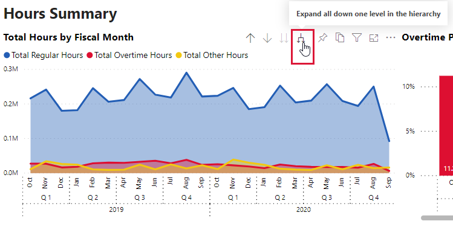
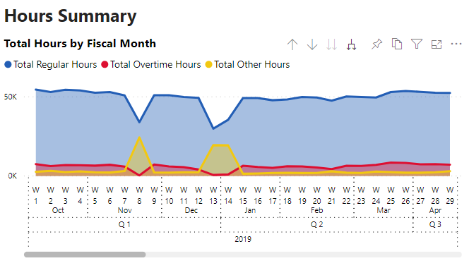

# Hours

## Introduction

This report gathers payroll hour information from TriNet and turns it into charts and tables that can help you monitor the number of hours in your department and project and identify trends with the amount of overtime.

At the moment we aren't able to drill down to the number of hours per day.  Instead the hours are shown as being on the Saturday for each week as that is the last day of each pay period.


DFS uses Sunday as the last day of the pay period.  In the case of anyone who has hours for DFS, the hours are shown on Saturday as well.

Example:  The Heath pay period for this week ends on Saturday, 9/26/2020.  The DFS pay period for this week ends on Sunday, 9/27/2020.  **For the purposes of this report only**, the DFS hours for this week will be included with the Heath hours for this week and the date will show as 9/26/2020.


## Report contents

As of this writing, the report has two visible pages:

* Hour Summary
* Overtime Study

## Information in the report:

Every Monday \(excluding holidays\), one report of the hours for the week is run for Heath and one is run for DFS.  The reports are sourced from the TriNet site.

Also on every Monday, four custom queries are run in HCM.  Those queries give us a list of all the employees, their location \(department & project\), job title, and status \(active, term, LOA\).

Various transformations are done to match up the employees and hours.  This is output into one file which has it's contents inserted into a table in a cloud database.  Power BI reads the table in the database and produces the report you see here.

The information goes back to the end of the first fiscal week of FY 2019 which translates to 10/6/2018.

## Things to know

### Screenshots

Some of the screenshots may be hard to read.  Clicking on it will make it larger and clicking on it again will put you back into this document.

### If you have suggestions, comments, or questions...

Please visit the [Power BI Tips, Tricks, & Answers Yammer group](https://www.yammer.com/heathus.com/#/threads/inGroup?type=in_group&feedId=20061200384&view=all) and post a message.

All suggestions and requests for features will be considered.  If they are included or not, and when they will be added is up to the departments that own the report and the Director of Information Technology.

I will answer questions as soon as I can get to them which is usually within a day.  It's been noted that I go a little overboard in answering questions, but it's because I want to be as thorough and transparent as possible.  If I don't fully answer your question, feel free to keep the convo going until I do.

### Available filters

Report level filters \(available on all pages\):

* Supervisor
* Date
* Department \(the Safety and Compliance version of this report has all departments available, the SBU version of the report only has the SBU departments available\)
* Project
* Fiscal Year
* Fiscal Quarter
* Fiscal Month
* Fiscal Week

Page level filters \(available on Overtime Study page only\):

* OT Category
* Employee
* Job Title

### Cross-highlighting

Like most Power BI reports, clicking on something in one chart will have an effect on the other charts.

For example, clicking on the Field Technician, Locator box in the Overtime Hours by Job Title chart on the Overtime Study page will filter and highlight the other charts.

## Report pages

### Hours Summary

The Total Hours by Fiscal Month shows the breakdown of hours for all the pay periods covered by the data \(drills down from the FY to week number\).

Click on the split arrow to drill down to the week level.

Clicking on the up arrow to the far left of the split arrow will bring you back up levels until you reach the FY level.  When the report is published, the chart is at the month level but you are free to drill to whichever you like.


On this chart and on the Overtime Pct. by Fiscal Month chart, the month names are the fiscal months, not the calendar months.


Overtime Pct. by Fiscal Month shows the overtime percentage for all the pay periods \(drills down from the FY to week number\).

Total Hours by Department shows the proportions and amounts of the hours by department and project \(drill down to get to the projects from the department level\).

Hours by Department, Project, and Date shows the breakdown of the hours by type and OT percentage by department and then drilling down to project.

The calculations for this page are explained below.

#### Total Other Hours -

Sum of hours column in the Payroll Hour table which have “Other” as an hour type.

Other hours are defined as all PTO, PTI, and Holiday hours.

#### Total Regular Hours -

Sum of hours in the Payroll Hour table which have “Regular” as an hour type.

Regular hours are defined as all hours not classified as “Other” up to 40 hours per week outside of California or 8 hours a day in California.

#### Total Overtime Hours -

Sum of hours in the Payroll Hour table which have “Overtime” as an hour type.

Overtime hours are defined as the “Regular” hours in excess of 40 hours per week outside of California or 8 hours a day in California.

TriNet automatically calculates the amount of overtime hours and displays it in a separate column in the report that we use.

#### Total Working Hours \(Hidden\) -

Total Regular Hours plus Total Overtime Hours.

#### Overtime Pct. -

\(Total Overtime Hours divided by Total Working Hours\) x 100

Sum of hours column in the Payroll Hour table which have “Other” as an hour type.

Other hours are defined as all PTO, PTI, and Holiday hours

Sum of hours in the Payroll Hour table which have “Regular” as an hour type

Regular hours are defined as all hours not classified as “Other” up to 40 hours per week outside of California or 8 hours a day in California

Sum of hours in the Payroll Hour table which have “Overtime” as an hour type

Overtime hours are defined as the “Regular” hours in excess of 40 hours per week outside of California or 8 hours a day in California

TriNet automatically calculates the amount of overtime hours and displays it in a separate column in the report that we use

Total Regular Hours plus Total Overtime Hours

\(Total Overtime Hours divided by Total Working Hours\) x 100

### Overtime Study

This page is to help show trends and more information about overtime.  It provides a set of different visuals to help show where excessive overtime may be coming from.  You can see information about different employees, departments, and job titles.

The Occurrences \(Bars\) and Total Overtime Hours \(Line\) chart in the top left divides the OT amounts into different categories, shows each time someone falls into that category, and also shows the total amount of overtime that's associated with each category.  The number of occurrences is represented by the bars, the amount of hours is shown by the line.

Below that is the Overtime Hours by Job Title which is exactly what it sounds like.  This is where you can see the proportion of OT by job title of the employee who incurred the OT.

On the top right is the OT Pct. as Proportion of Total OT chart.  The important thing to understand is that this is showing the **proportion** of OT hours by department, not the **total** amount of OT hours.  The way it works is by considering the OT hours only week by week and then finding out how much of the OT each week belongs to each department, and then representing that percentage as the different colors on the bar for each week.

This chart drills down to the week number the same way as the charts on the first page do.  Click the forked arrow to see this chart with the week numbers above the week ending dates.

You can also see more detail about each part of a bar by hovering over any of the different colors.

The two numbers next to Pct. Overtime might be a little confusing at first.  The first percentage is the OT percentage for that department.  In this case, 29's OT percentage is 3.32% for the week ending 1/4/2020 which is actually very good.  However, for that particular week, the 382.25 overtime hours made up 67.28% \(the number in parenthesis\) of the total amount of overtime hours across SBU.

Below this chart is a table of employees, their job titles, OT hours, the week ending date, supervisor for that week ending date, and their department & project.


The OT Hours column is color coded based on the **visible \(filtered\)** values for that column.  Light blue is the low end of the scale, representing the lowest values, yellow is for the middle, and light red is for the high end of the scale and the highest values.

The most important thing to keep in mind for this is that the color scale will change based on any filter selections you make.  The colors will change based on the highest and lowest values that are left after you've applied a filter.  A number that was one color before filtering may be a different color after filtering.

Example:  With no filters applied, pretend that 30.0 is the highest value in the OT hours column.  If you look at a person with 5.00 hours of OT is probably going to be blue or greenish because it's at the low end of the scale when 30.0 is the highest number.  However, if you apply filters and the highest value is now 5.00, that same 5.00 will turn red because it's now the highest value after the filters were applied.

This can be changed to rule based colors if that works better for everyone.  An example would be that any value less than x is a certain color, any value between x and y is another color, any value between y and z is a third color and so on.  Let your chain of command know so they can suggest it as a report change and define the color bands.


## FAQs

### Can't see employee info on the Hours Summary page?

This is because it's too much information for the Hours by Department, Project, and Date visual to handle.  It will crash the visual and display an error.

We will address this when we overhaul the data architecture and hopefully we'll be able to add this in.

## Changelog

### 9/22/2020

* Initial release

